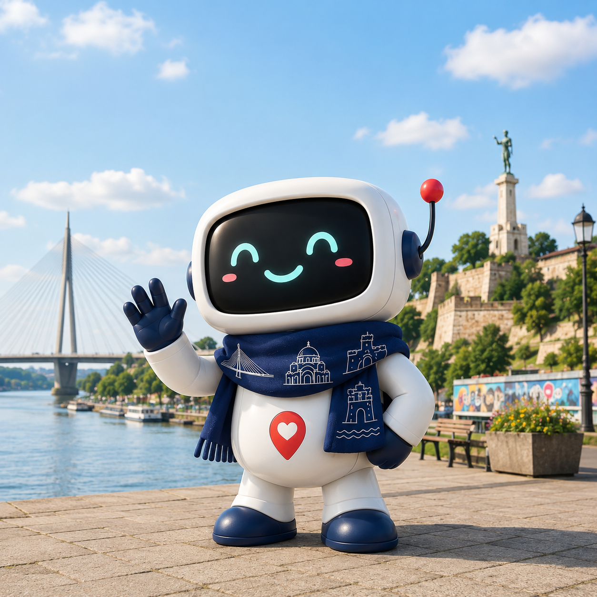

# Belgrade Guide Bot
Telegram AI bot integrated with Google Maps and local Belgrade event data.



The bot helps groups of friends in Belgrade find the best event or venue that works for everyone — concerts, restaurants, bars, and more.
---

## For Users

### What the bot can do

- Find events and activities happening in Belgrade (sourced from Telegram channels)
- Find upcoming concerts and ticket links
- Recommend restaurants with a reservation link
- Find bars, cafes, and other venues via Google Maps or OpenStreetMap
- Works in both **private chats** and **group chats**

### How to use it

**Private chat**

Just tell the bot what you're in the mood for. It will ask a few questions — your interests, any deal-breaker or must-haves— and then suggest the best match.

> "I'm looking for a craft beer bar with live music tonight"

**Group chat**

Add the bot to a group. It will greet everyone and ask each member to share their preferences. Once enough people have responded, it finds the best option that works for the whole group.

> The bot looks for Pareto-optimal suggestions — something where no one is miserable and everyone gets at least part of what they want.


## For Developers

### Prerequisites

- Docker
- API keys for:
  - [Google Gemini](https://aistudio.google.com/) (LLM)
  - [Google Places](https://console.cloud.google.com/google/maps-apis/credentials) (venue search)
  - Telegram Bot Token (see [setup guide](https://github.com/aleksandr-dzhumurat/tg_ai_bot_template/blob/main/docs/telegram.md))

### Setup

**1. Clone and configure environment**

```shell
mv env.template .env
```

Fill in your API keys in `.env`.

**2. Configure the model**

The LLM model is set in `src/configs/prod.yml` under `model.name`. Default: `gemini-2.5-flash`.

**3. Build the Docker image**

```shell
make build
```

This also creates the required local data directories (`data/phoenix_data`, `data/db`).

### Running

**Run the Telegram bot**

```shell
make run
```

Starts the bot and a Phoenix tracing sidecar (for observability). The bot connects to Telegram and begins handling messages.

**Run a console chat (for local testing)**

```shell
make chat
```

Launches an interactive terminal session with the agent — no Telegram connection needed.

**View conversation history**

```shell
make history
```

Queries the SQLite database and prints past messages (requires the bot container to be running).

**Stop the bot**

```shell
docker rm -f tg_ai_bot_container_tg
```

### Observability

The bot uses [Phoenix](https://phoenix.arize.com/) for LLM tracing. It starts automatically alongside `make run` and `make chat` as a Docker Compose service. Traces are stored in `data/phoenix_data/`.

### Project structure

```
src/
  ai_agent.py   # LangGraph agent, dialog router, chat history
  tools.py      # Tool definitions (venue search, events, concerts, restaurants)
  prompts.py    # System prompt
  config.py     # Config loader
  db.py         # SQLite chat history
  google_api.py # Google Places + OSM wrappers
scripts/
  chat.py       # Console chat entrypoint
  db_history.py # History viewer
data/
  db/           # SQLite database (auto-created)
  phoenix_data/ # Tracing data (auto-created)
evals/
  eval_json_extraction.py  # Group consensus behavioral eval suite
```

### Evals

`evals/eval_json_extraction.py` is a behavioral eval suite that tests the agent's group chat reasoning. It runs three tests against the live model using the system prompt:

**Test 1 — Deal-breaker detection.** One user says they hate loud clubs; another loves them. The bot should propose a compromise and not suggest a loud club.

**Test 2 — Group consensus waiting.** Only one user has shared preferences. The bot should ask for more input rather than immediately suggesting a venue.

**Test 3 — Preference attribution.** Two users share different preferences (quiet + vegan food vs. craft beer + relaxed vibe). When asked to summarize, the bot should correctly attribute each constraint to the right person.

Run with:

```shell
make eval
```

Exits `0` if all tests pass, `1` if any fail. Note: the eval includes deliberate delays between tests (`60–120s`) to avoid rate-limiting on the Gemini API.

### Extending the bot

The bot currently supports: Telegram events, concerts, restaurants, and general venue search. To add a new category (e.g. theatre, cinema, sports):

1. Add a new `@tool` function in `tools.py`
2. Register it in the `tools` list in `ai_agent.py`
3. Update the `TOOL PRIORITY` section in `prompts.py`
